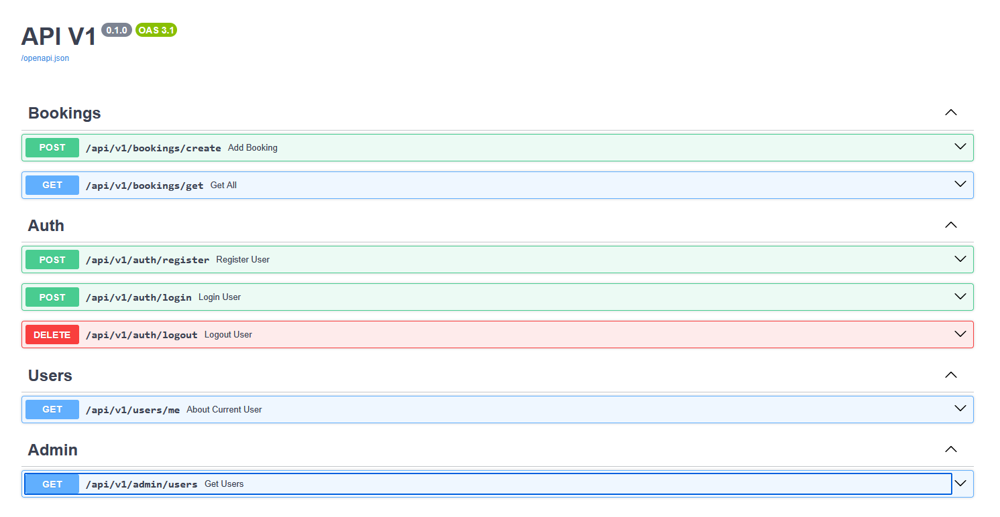

# Курс по FASTAPI от Артема Шумейко с доработкой под современные реалии.  

## Что пройдено (Юниты)?
1. Валидация данных с помощью `Pydantic`
2. Подключение и работа с СУБД `PostgreSQL` при помощи `SQLAlchemy`
2.1 Миграции БД при помощи `Alembic`. Изменены пару функций, чтоб была полная асинхронная работа `API` и `PostgreSQL`
3. Маленькие запросы к БД (`SELECT`, `INSERT`)
4. Авторизация и аутентификация при помощи `JWT` (добавлены роли - `admin` и `client`)
5. Кэширование Redis с использованием fastapi-cache
6. Работа с шаблонизатором Jinja2 (50/50)
7. Фоновые задания Celery с Redis
8. SQL CTE запросы. `JOIN`ы в том числе
## Что предстоит еще пройти
1. Доделать фронтенд на `React`
2. Припердолить мониторинг `Grafana/Zabbix/Prometheus`
3. Подумать над minikube (k8s)
## Запуск проекта
### Docker Compose
1. Установите docker на устройство. (https://docs.docker.com/get-started/get-docker/)
2. Создайте файл `.env` и заполните необходимые переменные окружения:
```.env
DB_PWD=
DB_USER=
DB_NAME=
DB_HOST_CONTAINER=postgres
DB_PORT=5432
DB_URL_CONTAINER="postgresql+asyncpg://${DB_USER}:${DB_PWD}@${DB_HOST_CONTAINER}:${DB_PORT}/${DB_NAME}"
DB_URL_LOCAL="postgresql+asyncpg://${DB_USER}:${DB_PWD}@${DB_HOST_LOCAL}:${DB_PORT}/${DB_NAME}"
PRIVATE_KEY= #тут сгенерировать приватный ключ hsm256 для шифрования паролей
ALGORITHM=HS256
ORIGINS=["127.0.0.1:3000"]
REDIS_PORT=6379
REDIS_PASSWORD=
REDIS_USER=default
REDIS_HOST=redis
REDIS_URL="redis://${REDIS_USER}:${REDIS_PASSWORD}@${REDIS_HOST}:${REDIS_PORT}"
```
3. После установки запустите проект командой из терминала, находясь в папке с проектом:
```bash
  docker compose up
```
4. Запустите скрипт `test_data_db.sql` в БД и пробуйте!